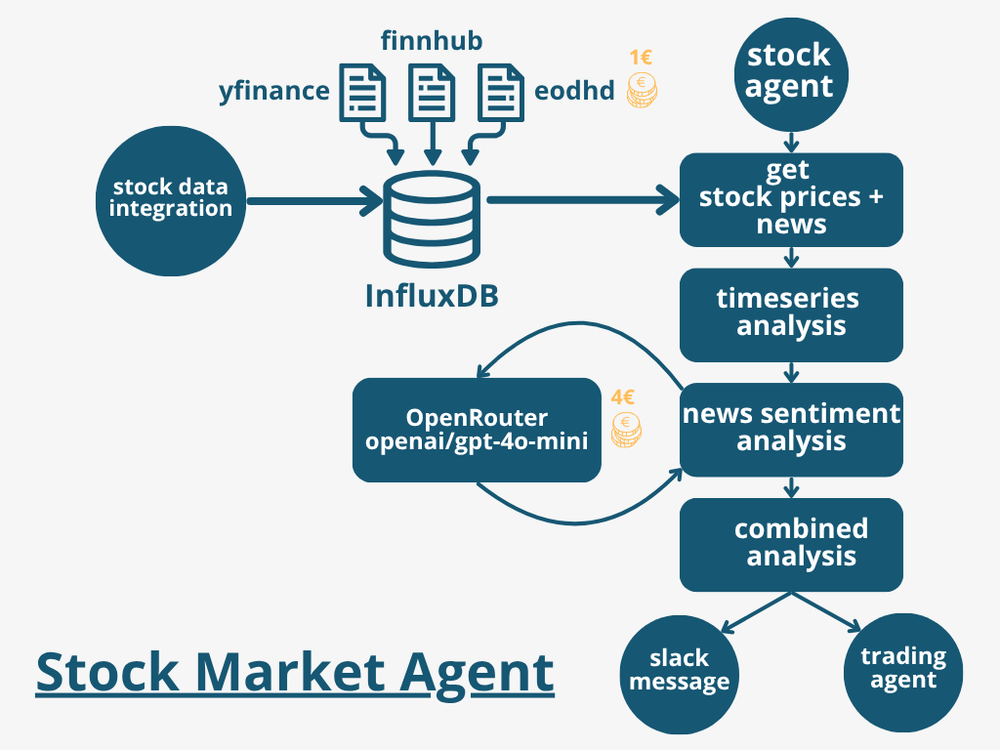

# stock-market-agent
Stock Market Agent: Classical Methods (Timeseries) + AI Sentiment (News)

## Architecture

## Requirements

- InfluxDB: < 190 MB for 3 stocks, 220 - 230 MB for 4-5 stocks, 260 - 370 MB RAM for 6-7 stocks and > 1.3 year of stock and news history

## installation

python=3.10

conda create -n finance python=3.10

## influxDB

setting up the db is straight forward:

1. login to http://localhost:8086/
2. setup the user, password, bucket, company name
3. retrieve the token and save it to the .env-file to the TOKEN variable
4. now you can run the code

## models for sentiment:

Meta: Llama 4 Scout (free) - too optimistic
Qwen: Qwen3 235B A22B (free) - too slow
google/gemini-2.0-flash-exp:free - LLM returns no integer (not defined)
google/gemini-2.5-pro-exp-03-25 - LLM returns no integer (not defined) (probably 429 rate limit)
google/gemini-2.5-flash-preview - good results but costs 0.65 Cents / 2 month -> 19.5 € for the whole timespan
google/gemini-2.0-flash-001 - probably comparable as 2.5 but would cost 13 € for the whole time
anthropic/claude-3.7-sonnet - probably very good but extremely expensive: 390 € for the whole thing
deepseek/deepseek-chat-v3-0324:free - works most time and for free!
meta-llama/llama-4-maverick:free - works fast but maybe a bit to extreme values
openai/gpt-4o-mini - good and plausible results, not too expensive